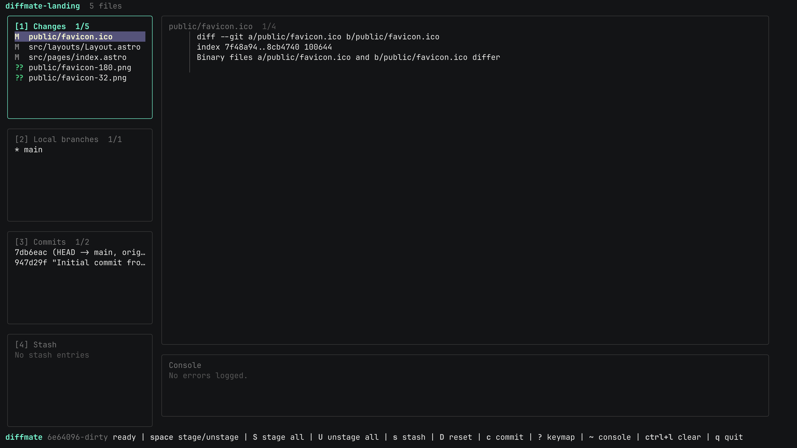
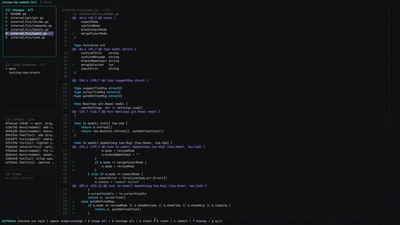
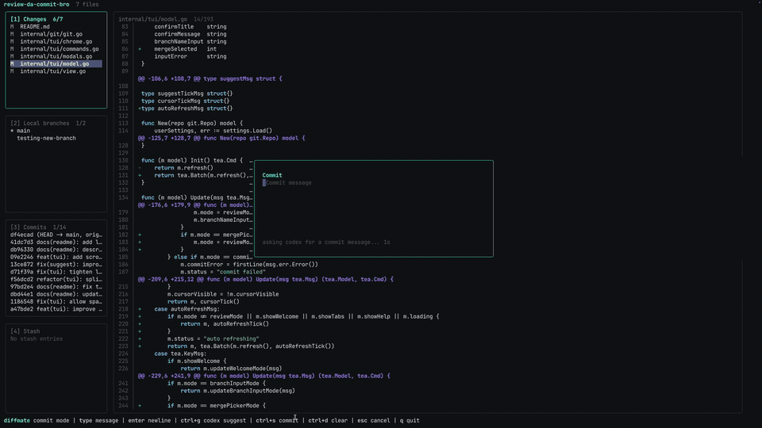
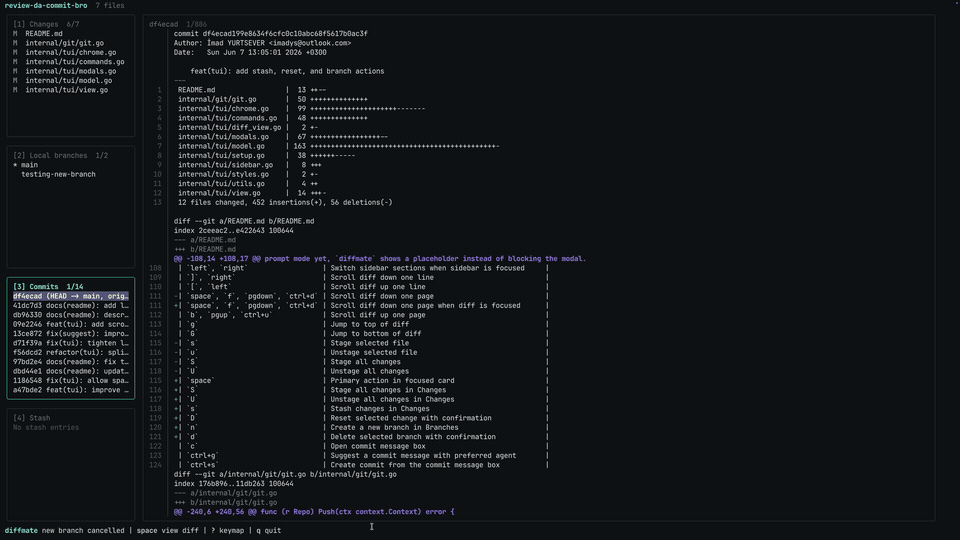

<p align="center">
  
</p>

Review your working tree from the terminal before committing.

`diffmate` is a focused Git TUI for people whose daily coding routine lives in the
terminal. Run it inside a repository, scan changed and untracked files, inspect
diffs, stage or unstage files, commit, push, and jump into your editor or coding
agent without leaving the keyboard.

## Preview

<p align="center">
  
</p>

<p align="center">
  
</p>
<p align="center">
  
</p>
<p align="center">
  
</p>

## Why

This is not trying to be something special or better than every other Git TUI.
It is built around how I personally want to review code before committing.

My daily workflow lives in the terminal now: Codex, Claude Code, Neovim, Git, and
small tools that stay out of the way. `diffmate` is my version of that for
reviewing a commit. I want to open it, see what changed, review the diff, stage
what I need, write or generate a commit message, and push without leaving the
terminal.

The app will probably change a lot as I use it. Some features might get added,
some might get removed, and some might stay simple on purpose. The point is to
adjust it around the daily workflow instead of building a huge Git client from
day one.

## Status

Early MVP. The first goal is a small, useful pre-commit review screen rather than
a full Git client.

## Install

Without installing Go:

```sh
curl -fsSL https://diffmate.imadys.dev/install.sh | sh
```

Manual install from GitHub Releases:

```sh
curl -L https://github.com/imadys/diffmate/releases/latest/download/diffmate-linux-amd64.tar.gz -o diffmate.tar.gz
tar -xzf diffmate.tar.gz
sudo install -m 755 diffmate /usr/local/bin/diffmate
```

With Go:

```sh
go install github.com/imadys/diffmate/cmd/diffmate@latest
```

From a local checkout:

```sh
make install
diffmate review
```

## Requirements

Required:

- Git installed and available in your `PATH`.

Optional:

- A preferred editor CLI for opening files or the project: `code`, `zed`,
  `cursor`, or `nvim`.
- A coding agent CLI for commit message suggestions: `codex`, `claude`, or
  `gemini`.

`diffmate` shells out to the Git CLI instead of using a Git library, so Git is
the only hard runtime dependency.

## Usage

```sh
diffmate review
diffmate docs
```

Running `diffmate` with no arguments also opens the review screen.

If the current directory is not a Git repository, `diffmate` opens a setup screen
and can initialize Git for that directory.

`diffmate docs` opens a two-pane Markdown browser for the current project. The
left pane lists project `.md` files as a file tree, and the right pane previews
the selected file. Folders can be collapsed, files can be searched, and selected
docs can be edited in place.

The review screen uses a bento-style terminal layout:

- Changes, branches, commits, and stash live in numbered sidebar cards.
- The diff panel fills the remaining terminal width.
- The console panel keeps Git and app errors visible under the diff.
- The footer keeps the main workflow shortcuts visible.
- The screen refreshes automatically every 3 minutes when no modal is open.

## Config

Press `,` inside the app to configure:

- Visible sidebar cards.
- Preferred editor: VS Code, Zed, Cursor, or Neovim.
- Preferred coding agent: Codex, Claude, Antigravity, or Gemini.

Config is saved in your OS config directory under `diffmate/config.json`.

## Merge Conflicts

If a merge creates conflicts, `diffmate` switches into a focused conflict mode:

- The left pane lists only conflicted files.
- The right pane shows the selected file with conflict markers highlighted.
- `o` accepts ours for the selected file.
- `t` accepts theirs for the selected file.
- `s` stages the selected file as resolved.
- `e` opens the selected file in your editor.
- `a` aborts the merge after confirmation.
- `c` continues the merge once conflicts are resolved.

## Tech Stack

- Go for the CLI and Git workflow logic.
- Bubble Tea for the terminal app architecture.
- Bubbles for reusable TUI pieces like the diff viewport.
- Lip Gloss for terminal styling and layout.
- Git CLI under the hood for repository operations.

## Commit Suggestions

In the commit modal, press `ctrl+g` to ask the configured coding agent for a
Conventional Commit message from the current diff.

Supported headless suggestion commands:

- Codex: `codex exec` using the account-supported default model.
- Claude: `claude -p` with `haiku`.
- Gemini: `gemini -p` with `gemini-2.5-flash`.

If the selected agent is not installed or does not support a verified headless
prompt mode yet, `diffmate` shows a placeholder instead of blocking the modal.

## Keybindings

| Key                              | Action                                              |
| -------------------------------- | --------------------------------------------------- |
| `j`, `down`                      | Move to next file                                   |
| `k`, `up`                        | Move to previous file                               |
| `1`-`4`                          | Focus sidebar cards                                 |
| `5`                              | Focus diff                                          |
| `tab`                            | Cycle cards and diff                                |
| `,`                              | Open config                                         |
| `t`                              | Open config sections                                |
| `/`                              | Search the focused sidebar card                     |
| `left`, `right`                  | Switch sidebar sections when sidebar is focused     |
| `]`, `right`                     | Scroll diff down one line                           |
| `[`, `left`                      | Scroll diff up one line                             |
| `space`, `f`, `pgdown`, `ctrl+d` | Scroll diff down one page when diff is focused      |
| `b`, `pgup`, `ctrl+u`            | Scroll diff up one page                             |
| `g`                              | Jump to top of diff                                 |
| `G`                              | Jump to bottom of diff                              |
| `space`                          | Primary action in focused card                      |
| `S`                              | Stage all changes in Changes                        |
| `U`                              | Unstage all changes in Changes                      |
| `s`                              | Stash changes in Changes                            |
| `D`                              | Reset selected change with confirmation             |
| `n`                              | Create a new branch in Branches                     |
| `m`                              | Pick a branch to merge into the current branch      |
| `u`                              | Update current branch from upstream                 |
| `d`                              | Delete selected branch with confirmation            |
| `D`                              | Delete selected remote branch with confirmation     |
| `ctrl+d`                         | Delete selected local and remote branch             |
| `c`                              | Open commit message box                             |
| `ctrl+g`                         | Suggest a commit message with preferred agent       |
| `ctrl+s`                         | Create commit from the commit message box           |
| `ctrl+d`                         | Clear commit message and modal errors               |
| `esc`                            | Cancel commit message box                           |
| `p`                              | Push current branch and set upstream if needed      |
| `o`                              | Open project in preferred editor                    |
| `a`                              | Open preferred coding agent                         |
| `e`, `enter`                     | Open selected file in the preferred editor          |
| `r`                              | Refresh                                             |
| `~`                              | Show or hide the console panel                      |
| `ctrl+l`                         | Clear console log history                           |
| `?`                              | Show full keymap                                    |
| `q`, `esc`                       | Quit                                                |

Conflict mode:

| Key        | Action                          |
| ---------- | ------------------------------- |
| `j`, `k`   | Move between conflicted files   |
| `[`, `]`   | Scroll conflict view            |
| `o`        | Accept ours for selected file   |
| `t`        | Accept theirs for selected file |
| `s`        | Stage selected file as resolved |
| `e`        | Open selected file in editor    |
| `a`        | Abort merge with confirmation   |
| `c`        | Continue merge                  |

Docs mode:

| Key                      | Action                                  |
| ------------------------ | --------------------------------------- |
| `j`, `k`                 | Move through files and folders          |
| `space`, `enter`         | Toggle selected folder                  |
| `right`                  | Focus document content                  |
| `left`                   | Return to the file tree                 |
| `/`                      | Search docs by path                     |
| `n`                      | Create a new Markdown file              |
| `enter` on a file        | Edit selected file                      |
| `ctrl+s` in edit mode    | Save edits                              |
| `shift+arrow` in edit    | Select text when the terminal supports it |
| `R`                      | Switch to review mode                   |

## Development

```sh
go test
go test ./...
go run ./cmd/diffmate review
```

## Roadmap

- Stage and unstage individual hunks.
- Toggle staged, unstaged, and all-changes views.
- Watch the repository and refresh automatically.
- Add Homebrew packaging.

## License

MIT
